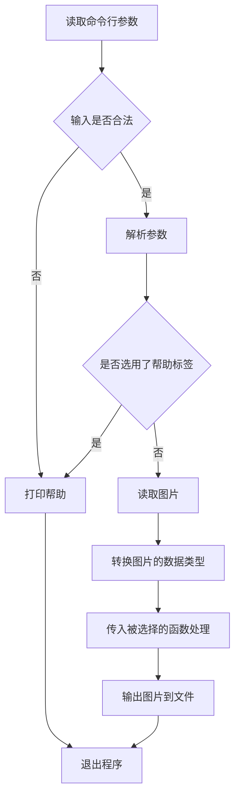

# 程序设计报告

## 程序功能

1. 采用命令行接口
2. 用户可以选择使用以下算法中的一个或多个进行图像修正
    1. MaxRGB (White Patch)
    2. Gray World
    3. Shades of Gray
    4. DOCC

## 程序设计思路

改程序使用了简洁的面向过程思路，其流程如下：

## 程序细节

1. 读取命令行参数以及解析使用了类 Unix 系统中一般有预装的 `getopt` 库，对命令行参数做到了“宽入”；
2.  读取图片使用了`Magick++` 库，可以支持各种类型的图片输入，之后的输出中也使用该库，支持各种类型的图片输出。没有选用 `OpenCV`, `CImg` 等成熟的图像库的原因是他们太过成熟，各种库函数一应俱全，若使用这些库不易体现本项目手动实现算法的意义；
3.  各算法均使用 `OpenBLAS` 实现，运行效率极高，可以胜任大批量的处理工作；
4.  由于 `OpenBLAS` 使用了类 Fortran 接口，而 `Magick++` 却使用了 C++ 风格的接口，两者并不兼容，需要进行数据类型转换，这一步开销较大，是程序的性能瓶颈，目前无较好的解决方案；

## 程序的优缺点

### 优点

1. 使用了较为底层的线性代数运算库，使得图像处理这一步效率尤其高，甚至可以媲美 numpy、matlab 等成熟的库与软件
2. 使用了命令行接口输入，易于与其他程序进行衔接
3. 既采用了快速的传统算法，也采用了效果优异的新算法

### 缺点及未来的改进方向

1. 所支持的算法较少，对只能基本覆盖可能的用户需求，在未来会逐步添加其它颜色矫正算法
2. 强行衔接两个库导致在数据类型转换这一步产生了较大的时间空间开销，在未来将使用更加底层的图像库进行图片读写（如 `libjpeg`，`libpng` 等），预计性能会得到显著的提升
3. 暂未支持自定义输出，在未来将添加 `-o` 标签
